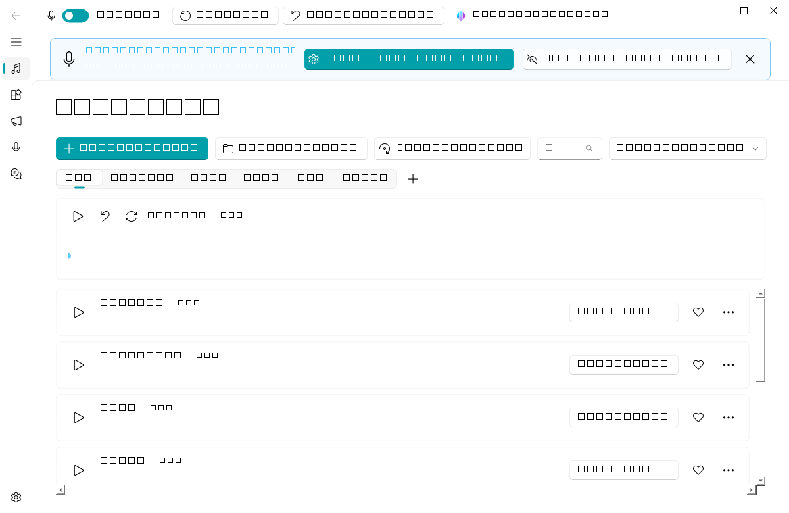
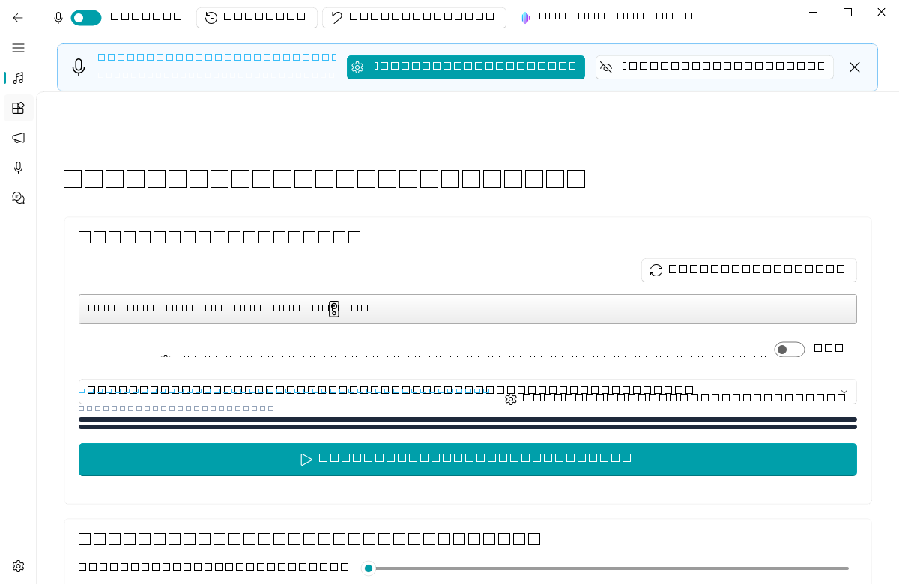
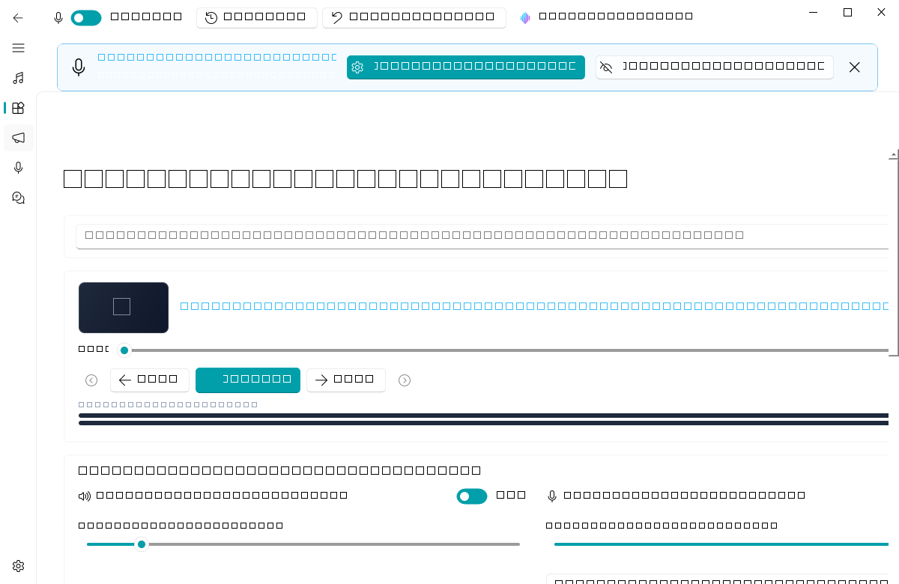
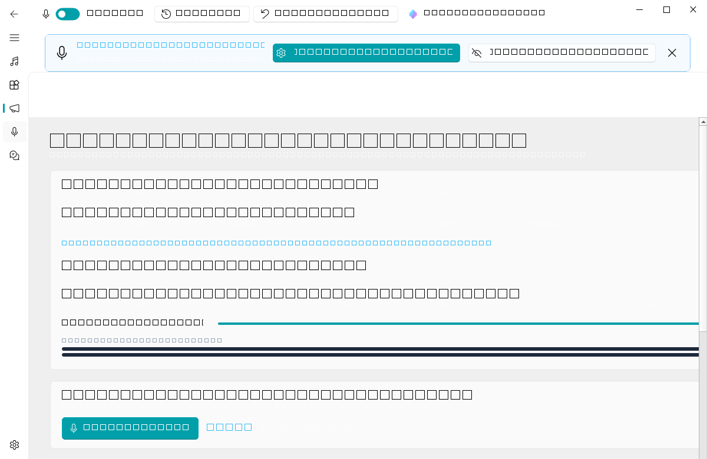
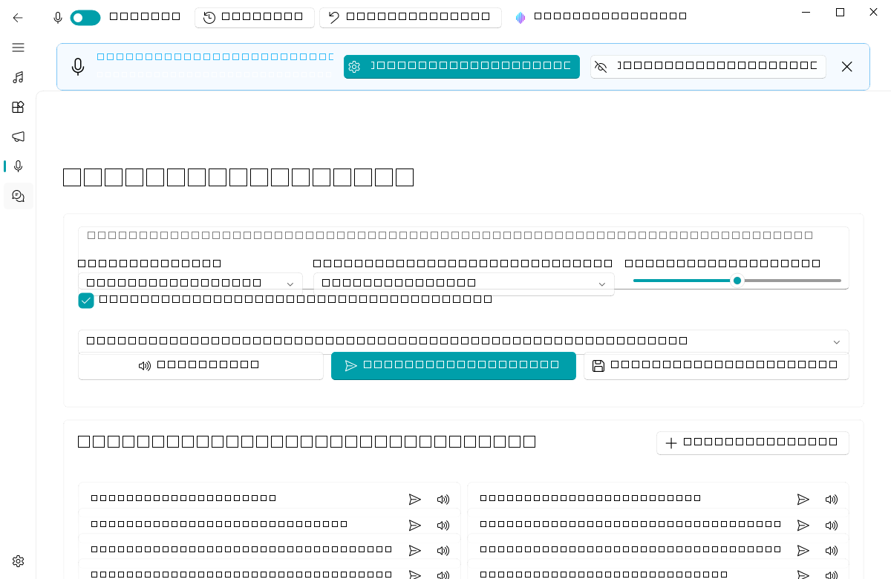

# ⚡ SoundFlow Studio

<p align="center">
  
</p>

<p align="center">
  <b>Next-Generation Soundboard, Application Audio Streamer & Real-Time Voice Studio for Windows</b>
</p>

<p align="center">
  <a href="https://github.com/MrPanica/SoundFlow/releases"></a>
  
  
  
  <a href="LICENSE"></a>
</p>

---

## 🌐 Language Navigation / Выбор языка
- [🇬🇧 English Description](#-english-description)
- [🇷🇺 Русское описание](#-русское-описание)

---

# 🇬🇧 English Description

**SoundFlow Studio** is an advanced, high-performance Soundpad alternative engineered for Windows 10/11. Built specifically for gamers, streamers, and content creators, it provides ultra-low latency audio playback, real-time application audio streaming, online radio broadcasting, live DSP voice morphing, neural text-to-speech, and automatic push-to-talk integration.



## 🚀 Key Features

### 1. 🎵 Next-Gen Low-Latency Soundboard
- **Instant Playback**: Zero-delay audio playback of `.mp3`, `.wav`, `.ogg`, `.flac`, and `.m4a` files.
- **Drag & Drop**: Simply drop any audio file into categories (*Memes*, *Gaming*, *SFX*, *Clips*).
- **Per-Sound Controls**: Individual volume, playback speed (0.5x – 2.0x), and pitch customization.
- **System-Wide Hotkeys**: Global hotkeys that trigger sounds even over borderless/fullscreen games (CS2, Dota 2, Valorant, Apex Legends).
- **Auto Loudness Normalization**: Automatic RMS-based peak leveling to avoid ear-destroying loudness spikes.
- **Panic Button**: Instant emergency mute and stop across all channels via `ESC`.

### 2. 🔀 Real-Time Application Audio Streamer (Live App Stream)

- **Direct App Capture**: Stream audio from any running Windows application (Chrome, Spotify, Telegram, Discord, media players, games) directly into your microphone for teammates.
- **Multi-App Selection**: Select multiple applications simultaneously with real-time process icons in both the dropdown items and the selector header button.
- **🔇 Mute for Self Only Toggle**: One-click switch to stream applications exclusively into the microphone (to teammates) while keeping your local headphones completely silent.
- **Zero-Echo Audio Engine**: Optimized WASAPI capture eliminates delayed double-sound and acoustic feedback loops in your headphones.
- **One-Click Windows Volume Mixer**: Dedicated button to open `ms-settings:apps-volume` to quickly route target apps to virtual audio devices.
- **Global Toggle Hotkey**: Enable/disable streaming anytime in-game using `Ctrl+F9`.

### 3. 📻 Global Online Radio & Media Streaming

- **Worldwide Catalog**: Built-in station presets and a searchable catalog of thousands of global radio stations.
- **YouTube & Web Streams**: Direct audio streaming from YouTube videos, playlists, Shorts, and Icecast/Shoutcast links.
- **Live Metadata**: Real-time display of track titles, artist names, and album artwork.
- **Playlist Controls**: Skip tracks, previous/next video navigation, and seek controls directly in the UI.

### 4. 🎙️ Real-Time Voice Changer & DSP Effects

- **Live Voice Morphing**: High-fidelity pitch shifting and audio modulation with ultra-low latency.
- **DSP Presets**: *Helium Chipmunk*, *Monster / Demon*, *Cyber Robot*, *Megaphone / Walkie-Talkie*, and *Space Echo*.
- **Adaptive Noise Gate**: Dynamic threshold noise suppression to eliminate background keyboard clatter and ambient fan noise.
- **Live Audio Monitor**: Optional "Hear Myself" preview with dedicated volume control.

### 5. 🗣️ Neural Text-to-Speech (Edge-TTS)

- **Microsoft Neural Voices**: High-naturalness voice synthesis in Russian and English (Dmitry, Svetlana, Guy, Jenny).
- **Live Broadcast to Mic**: Type any sentence and broadcast it instantly to Discord or in-game voice chat.
- **Save to Soundboard**: Turn synthesized phrases into permanent soundboard buttons with one click.

### 6. ⏺️ 30-Second Instant Replay Buffer
- **Continuous Rolling Buffer**: Records the last 15, 30, or 60 seconds of game and voice audio in memory.
- **Instant Clip Capture**: Press `Ctrl+F11` anytime to immediately export the clip to a `.wav` file and add it to your soundboard.

### 7. 🎮 Auto Push-to-Talk (Auto-PTT) & Voice Ducking
- **Automated PTT Key Activation**: Automatically presses and holds your game's voice chat activation key (e.g. `V` or `K`) whenever soundboard clips, radio, or TTS are playing.
- **Smart Voice Ducking**: Automatically attenuates background audio (soundboard/radio) by 75% whenever you speak into your microphone.

---

## 🎧 Audio Routing Setup (Discord, Games & Teamspeak)

To allow teammates in Discord, Telegram, or games to hear your soundboard and streamed apps:

1. **Install VB-Audio Virtual Cable**:
   - If not already installed, click **"1-Click Install"** on the banner at the top of SoundFlow, or download it from [vb-audio.com/Cable/](https://vb-audio.com/Cable/).
2. **In SoundFlow Studio $\to$ ⚙️ Settings**:
   - **Microphone Target Output**: Choose `[Windows WASAPI] CABLE Input (VB-Audio Virtual Cable)`.
   - **Headphones Monitor**: Choose your physical speakers/headphones (`Realtek Audio`, etc.).
   - **Physical Input Mic**: Choose your physical headset/desktop microphone.
3. **In Game / Discord Voice Settings**:
   - Set **Input Device (Microphone)** to `CABLE Output (VB-Audio Virtual Cable)`.
4. **In SoundFlow Studio $\to$ "Microphone & FX"**:
   - Ensure **"Enable Microphone in Mixer"** is toggled ON.

---

## 📥 Download & Installation

### Option 1 (Recommended): Prebuilt Portable Executable
Download the latest **`SoundFlow.exe`** from [**GitHub Releases**](https://github.com/MrPanica/SoundFlow/releases).  
*No installation required — completely portable, runs out of the box.*

### Option 2: Run from Source
```bash
git clone https://github.com/MrPanica/SoundFlow.git
cd SoundFlow
python -m venv .venv
.venv\Scripts\activate
pip install -r requirements.txt
python run.py
```

### Option 3: Build Executable Locally
```powershell
# Build standalone SoundFlow.exe:
.\scripts\build_and_release.ps1 -BuildOnly

# Build and create automated release on GitHub:
.\scripts\build_and_release.ps1 -Tag v1.0.1
```

---

## ⌨️ Default Global Hotkeys

| Hotkey | Action | Scope |
| :--- | :--- | :--- |
| `ESC` | **Stop All Sounds** (Panic Mute) | Global |
| `Ctrl + F9` | **Toggle App Audio Stream** (On / Off) | Global |
| `Ctrl + F10` | **Toggle Online Radio** (Play / Pause) | Global |
| `Ctrl + F11` | **Save 30s Instant Replay Clip** | Global |
| `Ctrl + F12` | **Toggle Voice Microphone** (Mute / Unmute) | Global |

---
---

# 🇷🇺 Русское описание

**SoundFlow Studio** — современный многофункциональный аналог Soundpad для Windows 10/11, спроектированный для геймеров, стримеров и авторов контента. 

Приложение объединяет в одном неоновом Fluent-интерфейсе: быстрый саундборд без задержек, **живой стрим звука из любых приложений Windows напрямую в микрофон**, каталог интернет-радио и YouTube-потоков, голосовой чейнджер (Voice Changer) с DSP-эффектами и нейросетевую озвучку текста (Edge-TTS).


## 🚀 Основные возможности

### 1. 🎵 Саундборд нового поколения
- Воспроизведение `.mp3`, `.wav`, `.ogg`, `.flac`, `.m4a` с околонулевой задержкой.
- Удобный Drag & Drop для мгновенного добавления аудиофайлов.
- Вкладки категорий: *Мемы*, *Игры*, *SFX*, *Клипы*.
- Индивидуальная настройка громкости, скорости (0.5x – 2.0x) и тональности (питча) для каждого звука.
- Глобальные хоткеи, работающие поверх любых полноэкранных игр (CS2, Dota 2, Valorant).
- Автоматическая нормализация громкости (RMS Limiter) для защиты слуха от резких перепадов.
- Паническая клавиша `ESC` — моментальный сброс воспроизведения на всех каналах.

### 2. 🔀 Трансляция звука из приложений прямо в микрофон

- **Прямой захват**: транслируйте звук браузера (YouTube, Twitch), Spotify, Telegram или игр прямо в микрофон вашим тиммейтам.
- **Мульти-выбор приложений**: возможность выбрать несколько приложений одновременно с отображением реальных иконок `.exe` как в списке, так и в шапке кнопки выбора.
- **🔇 Тумблер «Заглушить только у себя»**: звук приложений идет только в микрофон тиммейтам, а в ваших наушниках сохраняется 100% тишина.
- **Устранение эха**: переработанная архитектура WASAPI Loopback исключает задвоение звука и акустическую обратную связь.
- **Кнопка микшера Windows**: быстрый вызов `ms-settings:apps-volume` в один клик для гибкого перенаправления вывода приложений.
- **Глобальный хоткей**: включение и отключение трансляции по `Ctrl+F9`.

### 3. 📻 Интернет-радио и медиапотоки

- Каталог тысяч радиостанций со всего мира с поиском по странам и жанрам (Lofi, EDM, Rock, Pop, Jazz).
- Воспроизведение обычных видео, шортсов и плейлистов YouTube прямо в микрофон.
- Отображение текущего трека и обложки в реальном времени (ICY Metadata).
- Управление треками: кнопки «Следующее видео», перемотка на 10 секунд, список треков плейлиста.

### 4. 🎙️ Голосовые DSP-эффекты и шумоподавитель

- Изменение высоты и тембра голоса в реальном времени.
- Готовые пресеты: *Бурундук (Helium)*, *Демон / Монстр*, *Кибер-робот*, *Рация / Мегафон*, *Космическое эхо*.
- Адаптивный гейт (Noise Gate) с регулируемым порогом для отсечения шума клавиатуры и микрофона.
- Предпрослушивание «Слышать себя» с отдельным регулятором громкости.

### 5. 🗣️ Нейросетевой Text-to-Speech (TTS)

- Натуральные нейросетевые голоса Microsoft Neural (Дмитрий, Светлана, Guy, Jenny).
- Озвучка на лету с отправкой напрямую в микрофон в Discord / играх.
- Кнопка «Сохранить на саундборд» — моментальное сохранение фразы в виде кнопки саундборда.

### 6. ⏺️ Моментальный повтор (Буфер 30 секунд)
- Непрерывный циклический буфер последних 15 / 30 / 60 секунд звука.
- По нажатию `Ctrl+F11` фрагмент сохраняется в `.wav` и сразу добавляется в саундборд.

### 7. 🎮 Авто-PTT (Auto Push-to-Talk) и Voice Ducking
- Автоматическое зажатие клавиши активации микрофона в игре (например, `V`) при воспроизведении звуков.
- Приглушение звуков саундборда и радио на 75% в момент, когда вы начинаете говорить в микрофон.

---

## 🎧 Настройка звука для Discord и игр

1. **Установите виртуальный кабель VB-Audio**:
   - Нажмите **«Установить в 1 клик»** на верхнем баннере в SoundFlow или скачайте с [vb-audio.com/Cable/](https://vb-audio.com/Cable/).
2. **В SoundFlow Studio $\to$ ⚙️ Настройки**:
   - **«Вывод в микрофон»**: выберите `[Windows WASAPI] CABLE Input (VB-Audio Virtual Cable)`.
   - **«Устройство мониторинга»**: выберите ваши физические наушники / динамики.
   - **«Физический микрофон»**: выберите ваш реальный микрофон.
3. **В Discord / игре**:
   - В качестве устройства ввода (микрофона) укажите `CABLE Output (VB-Audio Virtual Cable)`.
4. **Во вкладке «Микрофон и FX»**:
   - Убедитесь, что включен тумблер **«Включить микрофон в миксер»**.

---

## 🛠️ Установка и запуск

### Вариант 1 (Рекомендуемый): Скачать готовый EXE
Скачайте готовый релиз **`SoundFlow.exe`** из раздела [**GitHub Releases**](https://github.com/MrPanica/SoundFlow/releases).  
*Программа портативная, установка не требуется.*

### Вариант 2: Запуск из исходников
```bash
git clone https://github.com/MrPanica/SoundFlow.git
cd SoundFlow
pip install -r requirements.txt
python run.py
```

### Вариант 3: Автосборка
```powershell
# Локальная сборка SoundFlow.exe:
.\scripts\build_and_release.ps1 -BuildOnly

# Автосборка и создание релиза на GitHub:
.\scripts\build_and_release.ps1 -Tag v1.0.1
```

---

## ⌨️ Таблица горячих клавиш

| Горячая клавиша | Действие | Где работает |
| :--- | :--- | :--- |
| `ESC` | **Остановить все звуки** (Panic Stop) | Поверх всех окон и игр |
| `Ctrl + F9` | **Вкл/выкл стрим приложений** | Поверх всех окон и игр |
| `Ctrl + F10` | **Старт/пауза интернет-радио** | Поверх всех окон и игр |
| `Ctrl + F11` | **Сохранить клип последних 30с** | Поверх всех окон и игр |
| `Ctrl + F12` | **Заглушить/включить микрофон** | Поверх всех окон и игр |

---

## 📄 License
This project is licensed under the MIT License — see the [LICENSE](LICENSE) file for details.

